# Adventure Riders Bike Meet and Events Club

## Contents

* Introduction
* The Website Design Purpose
* User Story
* Pages
* Page Sections
* Media Queries
* Testing
* Deployment
* Acknowledgments

# 

# Introduction

This website was created as the first part of my Portfoilio Project for a Diploma in software development currently uindertaken with The Code Institute.
The purpose of the website is to demonstrate my learning and understanding of HTML and CSS.

# The Website Design Purpose

The website has been designed for a small adventure bike riders club to showcase their club and gain interest for others to join.  
The website has been designed to atract attention by the way of motorcycle images, links to other websites, where discounts are given when using the cluibs discount codes, and links to dealerships where people can view new motorcycles in their local dealerships.  

# User Story  

As a user of the ADV Riders website I want to be able to understand the purpose of the club and see what benefits I gain from joining. I would like to scroll through the site to gather information on what the club is all about. By looking at the events section such as "Wheelie School" I am able to see what each event is by viewing videos of previous events. I am able to see the meet times of all of the bike meetings which describe the routes that each meet takes. 
The dealership section has logos of popular motorcycle dealers which act as lonks to the main dealer websites. 
By clicking the vavigation buttons on the websites header I am able to view the gallery, which shows my images of previous meets and events. The Contact button takes me to an additional page which allows me to contact the club with any queries that I have regarding their club and how to join. 

# Pages

There are three different pages added to the site.  
+ Homepage  
+ Gallery  
+ Contact

## Homepage  
The homepage is the main page where the majority of the content lies.  
The homepage starts with a nav bar which allows the user to navigate through the different pages of teh site and also the main pages sections by clicking on the smaller nav icons.    

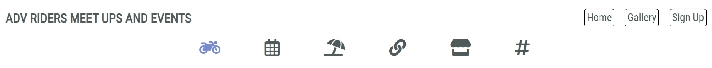  

The navigation icons enable the user to quickly jump to each section of the site. Sections include Main, Meets, Events, Links, Dealership and Social. Page sections are described further on within this README file.  

## Gallery

The Gallery page is again another page to showcase the clubs interests and previous meets within the club (club doesn't exist so I used images from the web). All images have been descaled in size using tinypng.   
The main nav bar is kept the same to keep the same feel as the main page ensuring familiarity, for the user, through all pages.    

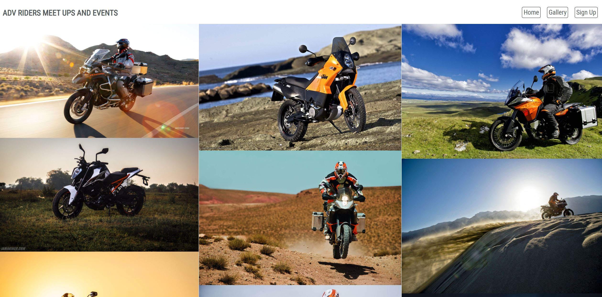  

## Contact  

The Contact page allows the user to contact the club to raise their interests in joining. The page, again, follows the same design as the homepage to ensure familiarity for the user.  
A simple contact form has been designed for ease of use and self explanitary using placeholder text for each section to complete. All sections of the form are required to enable the user to submit.  

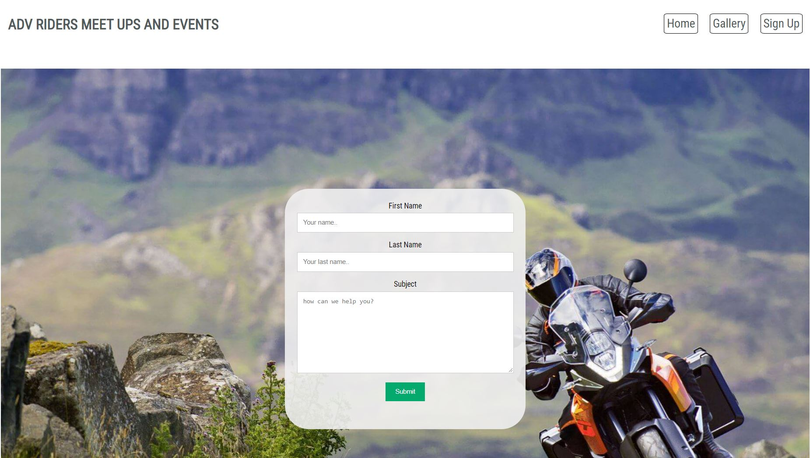  

# Homepage Sections

## Main

The Main section of the homepage is a large image, to catch the eye of the user, and a short description of the clubs purpose.

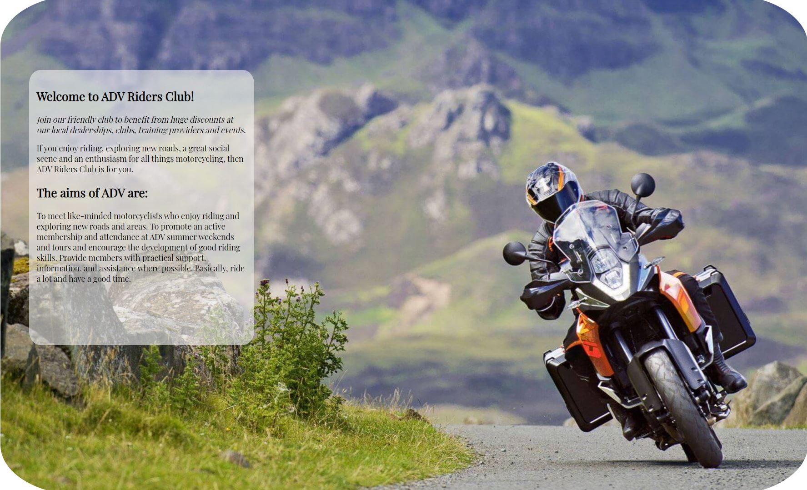

## Meetings

The meetings section provides the user with days, times and locations of all of the organised meets throughout the week. 

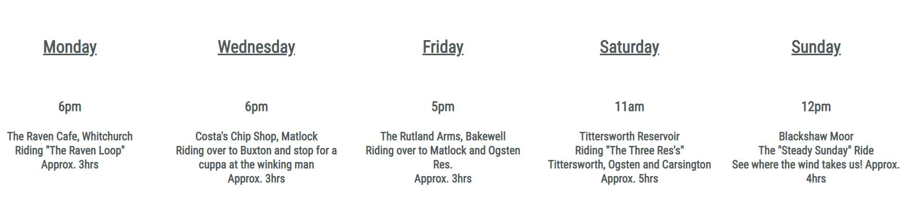

## Events  

The events sections provides the user with information regarding events that can be booked through the owners websites and using the clubs discount codes to recieve discounts on all bookings. Each event has a video from the owners youtube channel advertising their events. The user is able to click the video to either preview within the small iframe or can enlarge the video to full screen if preffered.

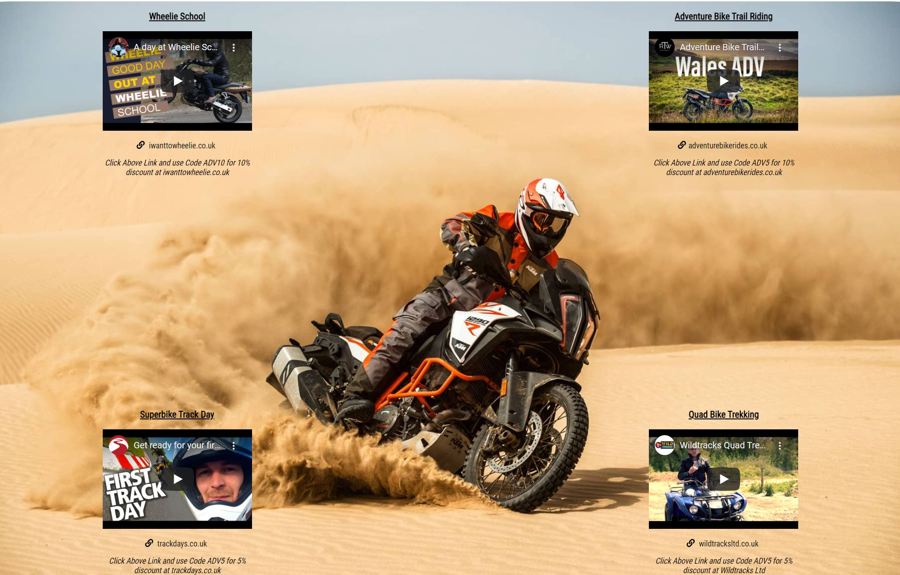

## Dealership

The dealership section provides links to popular dealerships that are used within the adventure bike riding community. Each link is displayed as a logo for the corresponding dealer. KTM, Honda, BMW and Kawasaki.

## Social

The social section allows the user to visit the social media pages of the club (again club doesn't exist so only links to the corresponding social media platform). Each link is displayed by using the icons for each platform.  
Facebook, Twitter, Instagram and LinkedIn.

# Media Queries

The page has been designed to be responsive dependant on the screen size that the user chooses.  
I used the dev tools within Google Chrome to test how the media query will work.  
Using Ipad and Iphone as base screen sizes i was able to change the design of the page to suit.  
Also due tousing a 27" screen myself I changed the style of the webpage to suit larger screens as wella s smaller.

# Media Query Changes

# Main Page

For the main page I used a wider image to suit larger screens as the original image didn't display the width of the full screen over 24" screen size. 

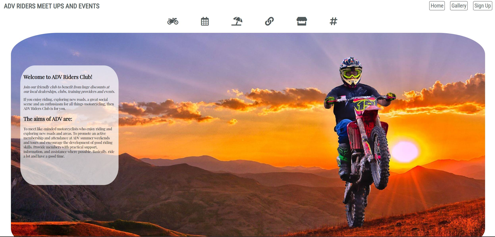  

For a smaller Ipad screen I reduced the font size and moved the main image to the left on the x-axis to ensure that the motorcycle within the image was still displayed clearly and not hidden due to the narrow screen size.

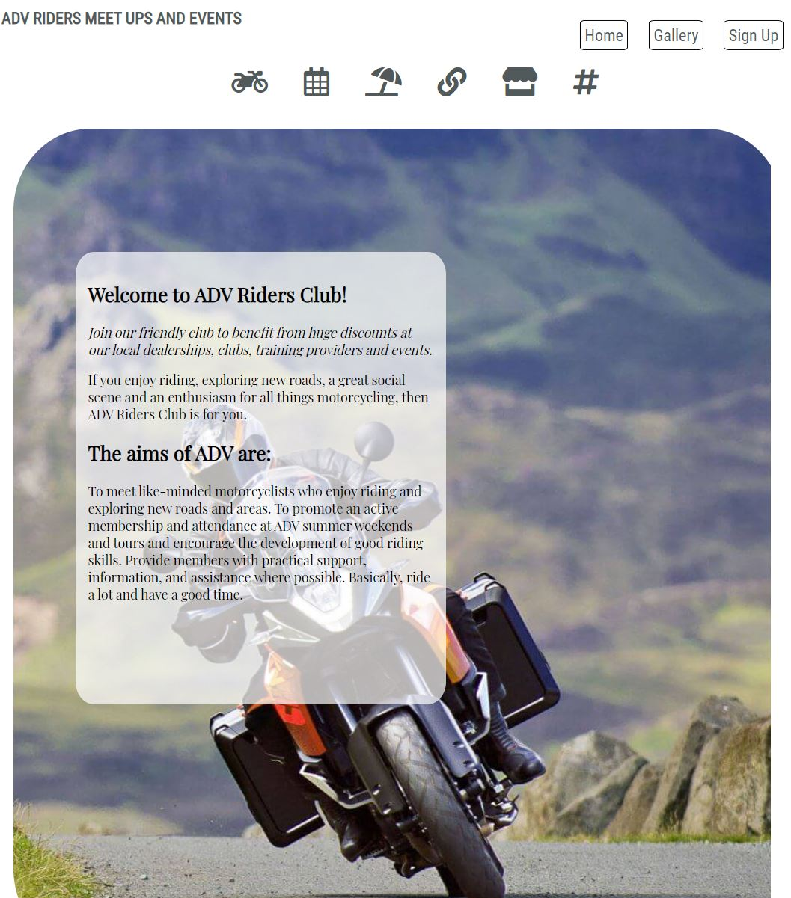 

For an even smaller Iphone screen I removed the page navigation bar to minimise the amount of screen content. I centered the page navigation buttons and page description for a even look.

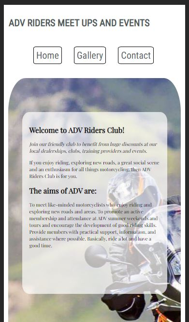

# Meets

For the Meets Section whern using an ipad I reduced the font-size to keep a similar look of the main webpage, keeping the meet divs inline.

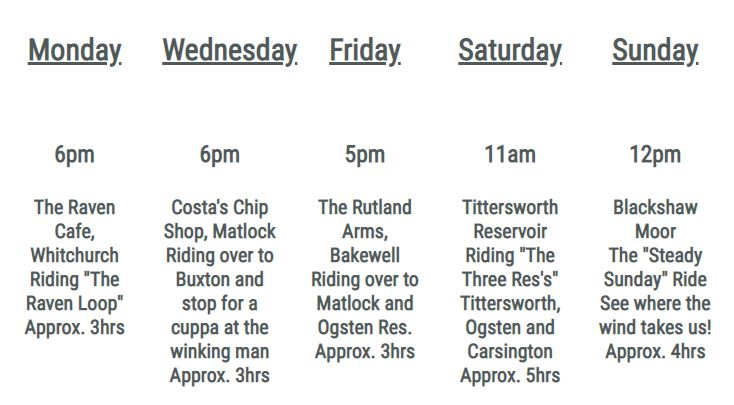

For the Iphone I found that the text was too small to view so enlarged the text and displayed in a vertical block, keeping the divs centered within the screen.

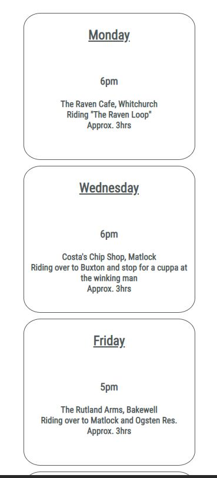

## Events

For the events section on both ipad and Iphone I was able to reduce the font-size to suit each screen size and still keep the original design.

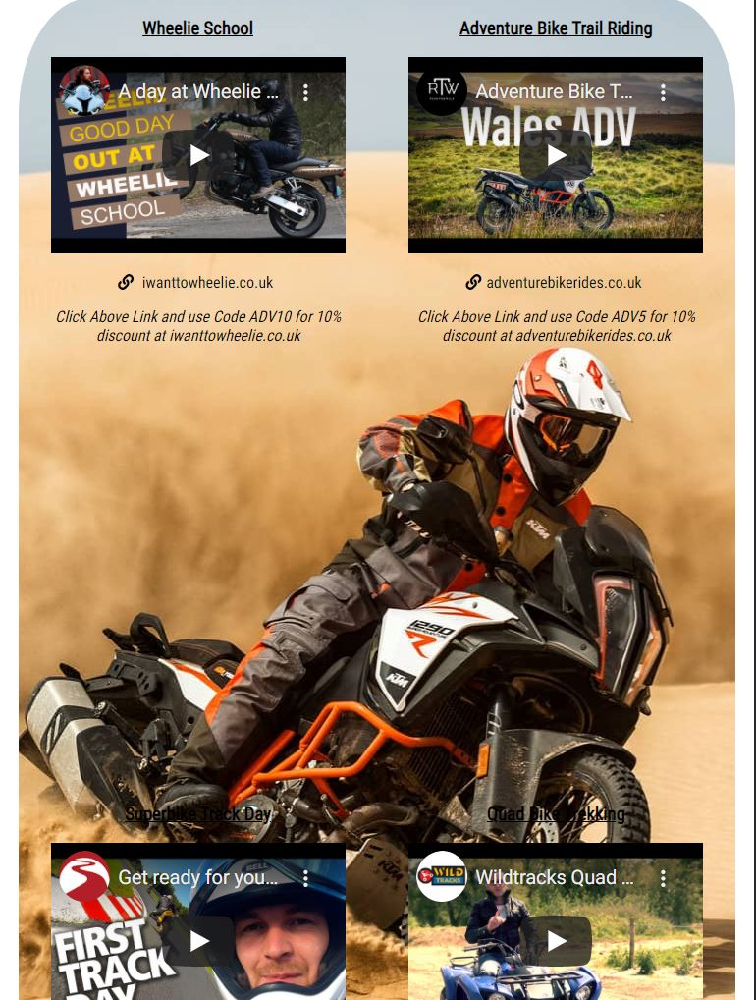

For the Iphone I removed the background image and kept the color as white to suit the rest of the page design.

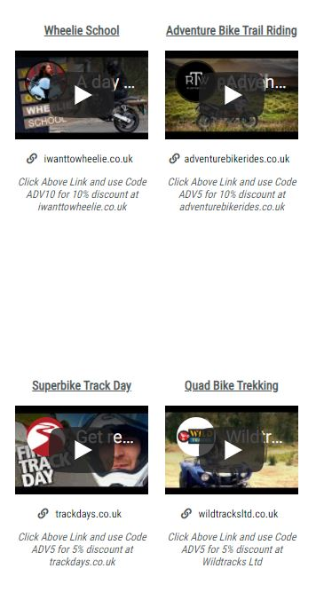 

## Dealership and Social

For both Iphone and Ipad I was able to reduce the size of the logos and icons to keep the design the same as the original webpage to display inline.

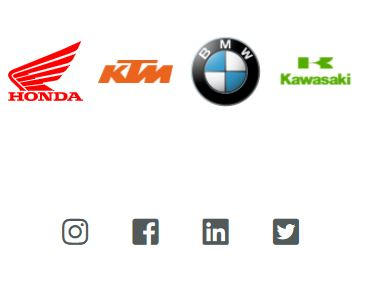

# Testing

To test the webpage and it's features I scrolled through the page using its features without any issues.  
 I used the dev tools app within Google Chrome to test the media queries where issues started to show. Mainly divs and sections overlapping. I used the dev tool to change the css code until the page displaeyd properly. I then changed the css code to suit within the media query sections. Also iframes and logos became distorted and overlapping. Again used dev tool to rectify and copied code in CSS. I then copied the link and opened on my own tablet and mobile phone to ensure that the pages display as designed.   
In addition to the physical testing all HTML and CSS code have been pushed through the validator without any errors.  
Two warnings showing as below.

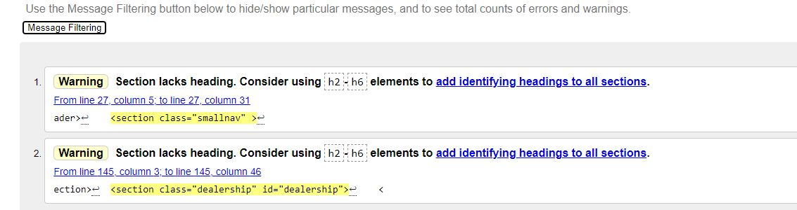

# Deployment

To deploy this project I used Github and gitpod. I first created a repository using the Github terminal. I then cloned the repoository to a folder of which I wanted to store the project. I then added the index.html file. After completing the code I created a CSS file to enable me to style the project. I then added, comitted and pushed all changes to the staging area.
I then deployed to Github by going to settings, pages, select root and saved the file. The project was then branched to github for viewing.

## Acknowledgements

All images courtesy of Pinterest.  
Code validation courtesy of W3C.  
Code formatting courtesy of webformatter.com.  
Logo images courtesy of wikipedia and pinterest.

