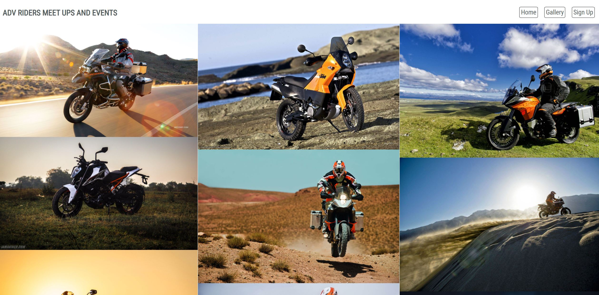
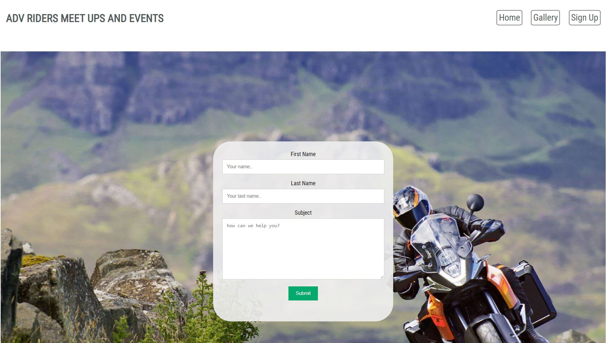

# Adventure Riders Bike Meet and Events Club

## Contents

* Introduction
* The Website Design Purpose
* Pages
* Page Sections

# 

# Introduction

This website was created as the first part of my Portfoilio Project for a Diploma in software development currently uindertaken with The Code Institute.
The purpose of the website is to demonstrate my learning and understanding of HTML and CSS.

# The Website Design Purpose

The website has been designed for a small adventure bike riders club to showcase their club and gain interest for others to join.  
The website has been designed to atract attention by the way of motorcycle images, links to other websites, where discounts are given when using the cluibs discount codes, and links to dealerships where people can view new motorcycles in their local dealerships.  

# Pages

There are three different pages added to the site.  
+ Homepage  
+ Gallery  
+ Contact

## Homepage  
The homepage is the main page where the majority of the content lies.  
The homepage starts with a nav bar which allows the user to navigate through the different pages of teh site and also the main pages sections by clicking on the smaller nav icons.    

  

The navigation icons enable the user to quickly jump to each section of the site. Sections include Main, Meets, Events, Links, Dealership and Social. Page sections are described further on within this README file.  

## Gallery

The Gallery page is again another page to showcase the clubs interests and previous meets within the club (club doesn't exist so I used images from the web). All images have been descaled in size using tinypng.   
The main nav bar is kept the same to keep the same feel as the main page ensuring familiarity, for the user, through all pages.    

  

## Contact  

The Contact page allows the user to contact the club to raise their interests in joining. The page, again, follows the same design as the homepage to ensure familiarity for the user.  
A simple contact form has been designed for ease of use and self explanitary using placeholder text for each section to complete. All sections of the form are required to enable the user to submit.  

  

# Homepage Sections

## Main

The Main section of the homepage is a large image, to catch the eye of the user, and a short description of the clubs purpose.

## Meetings

The meetings section provides the user with days, times and locations of all of the organised meets throughout the week. 

## Events  

The events sections provides the user with information regarding events that can be booked through the owners websites and using the clubs discount codes to recieve discounts on all bookings. Each event has a video from the owners youtube channel advertising their events. The user is able to click the video to either preview within the small iframe or can enlarge the video to full screen if preffered.

## Dealership

The dealership section provides links to popular dealerships that are used within the adventure bike riding community. Each link is displayed as a logo for the corresponding dealer. KTM, Honda, BMW and Kawasaki.

## Social

The social section allows the user to visit the social media pages of the club (again club doesn't exist so only links to the corresponding social media platform). Each link is displayed by using the icons for each platform.  
Facebook, Twitter, Instagram and LinkedIn.

